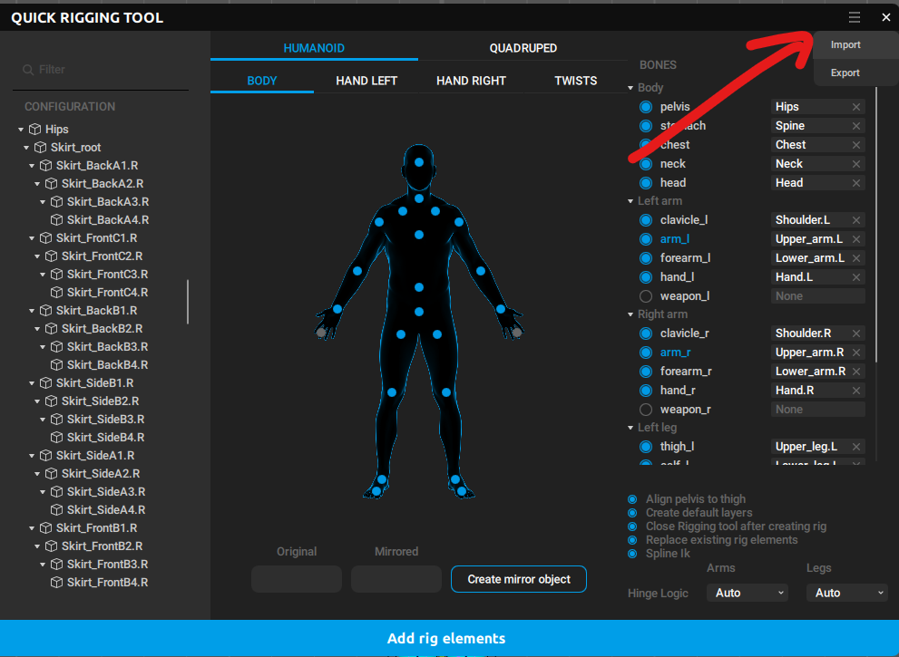

# qrigcasc Generator for Unity Humanoid

Unity Humanoidアバターから`.qrigcasc`ファイルを生成するUnityエディター拡張ツールです。

## 概要

このツールは、Unity HumanoidリグをCascadeur利用できるRig生成用フォーマット`.qrigcasc`に変換するためのエディター拡張スクリプトです。FBXファイルまたはAvatarアセットから自動的にボーンマッピングを抽出し、JSON形式で出力します。

## 使用方法

### 1. ツールを開く

Unityメニューから `Tools > Qrigcasc Generator` を選択します。

### 2. 入力設定

以下の2つの方法でアバターを指定できます：

#### 方法A: FBXファイルから自動取得（推奨）
1. **FBX File (Optional)** フィールドにFBXファイルをドラッグ&ドロップ
2. 自動的にTarget AvatarとTarget GameObjectが設定されます
3. 出力ファイル名もFBX名から自動生成されます

#### 方法B: 手動設定
1. **Target Avatar**: Avatarアセットを指定
2. **Target GameObject**: アバターのGameObject（シーン内またはプレハブ）を指定

### 3. 出力設定

- **Output Path**: 出力先ファイルパス（デフォルト: `Assets/GeneratedTemplate.qrigcasc`）

### 4. オプション設定

- **Include Settings in JSON**: チェックを入れると以下の設定をJSON出力に含めます
  - **Is align pelvis**: Pelvisアライメントを有効化
  - **Is create layers**: レイヤー作成を有効化

### 5. 生成

**Generate qrigcasc** ボタンをクリックして`.qrigcasc`ファイルを生成します。

### 6. 読み込み

生成された`.qrigcasc`ファイルはCascadeurのQuick Rigging Toolで読み込むことができます。

## 注意事項

- Unity Humanoidリグとして正しく設定されたアバターが必要です